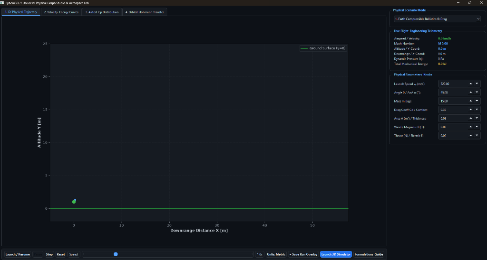
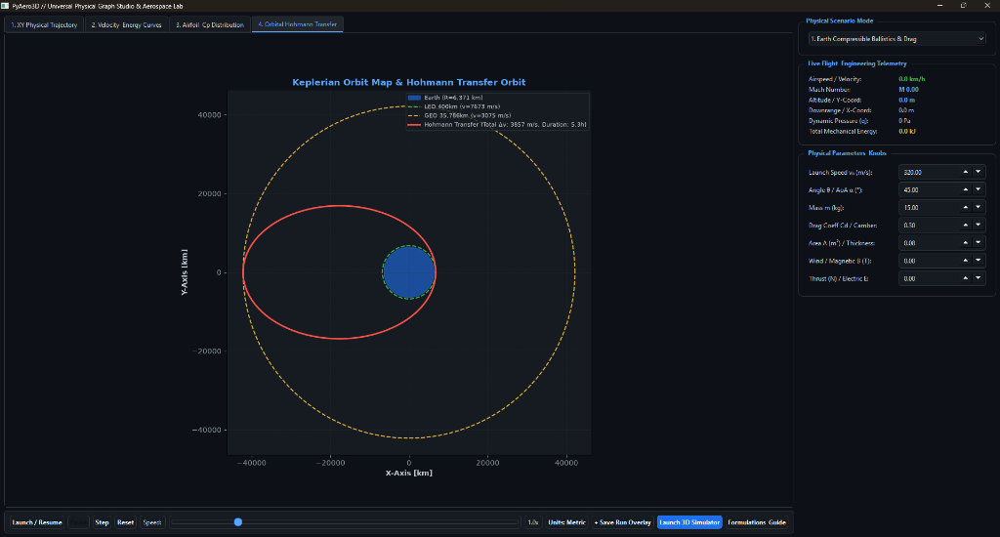
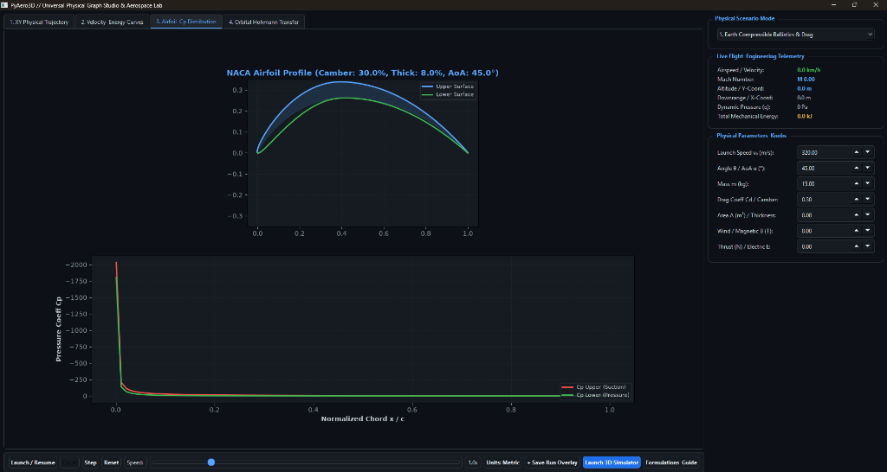
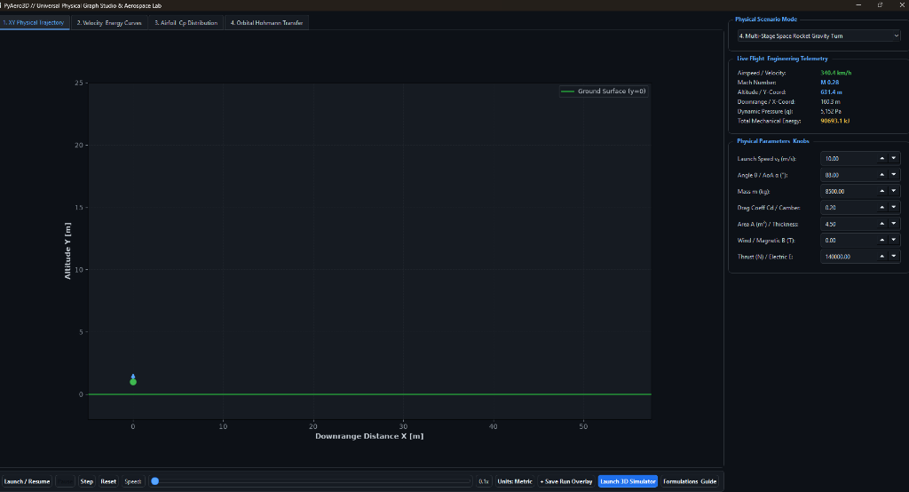
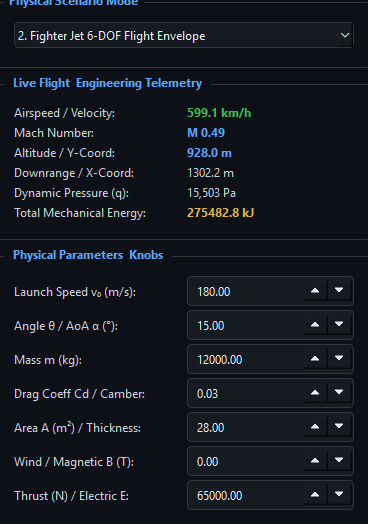
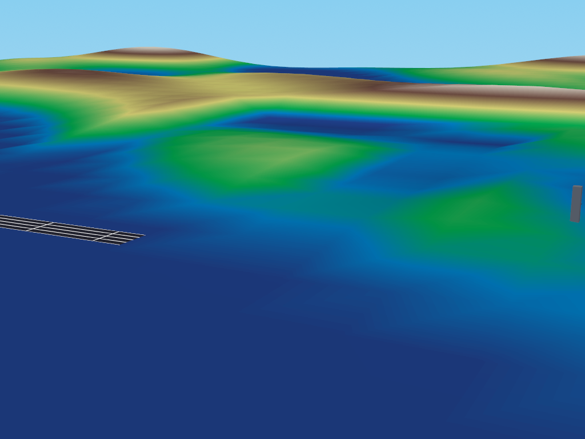
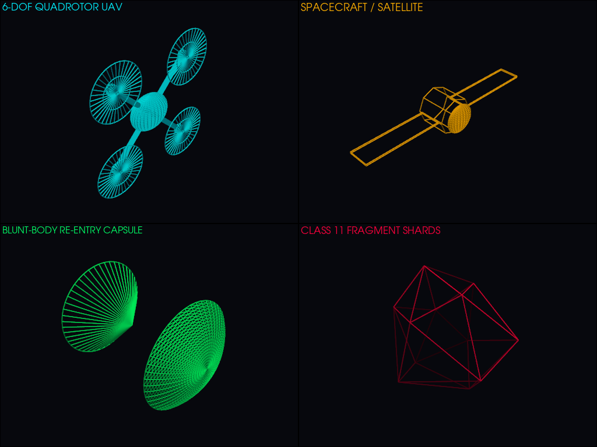
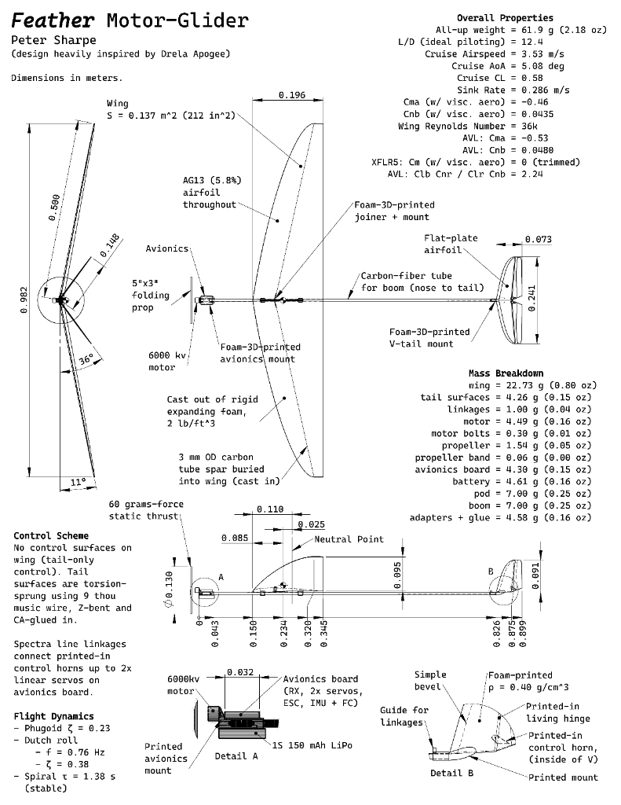
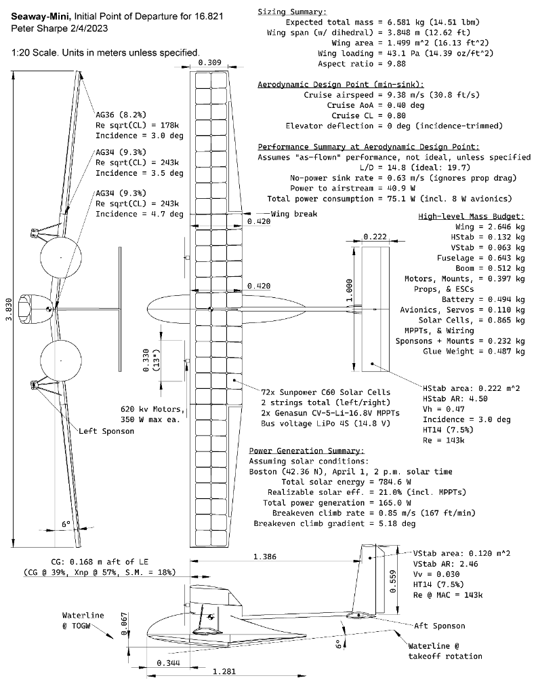

# PyAero3D: Universal 3D Multi-Physics & Aerospace Simulation Engine

[](https://python.org)
[](docs/ARCHITECTURE.md)
[](docs/ARCHITECTURE.md)
[](docs/USER_GUIDE.md)
[](LICENSE)
[](tests/)

**PyAero3D** is a general-purpose 3D multi-physics simulation engine and aerospace sandbox built from first principles. It unifies **6-DOF rigid-body dynamics**, **GJK / EPA convex collision detection**, a **Projected Gauss-Seidel (PGS) constraint solver**, **multi-body articulated joints**, an **interactive Physical Graph Studio with 8 multi-domain physical scenarios**, and a **1000Hz multi-domain aerospace flight core**.

---

## Physical Graph Studio & Workspace Showcase

<div align="center">
  
  <p><em>Interactive Cartesian XY Physical Trajectory Workspace: displays real-time atmospheric ballistics, ground reaction boundaries, velocity/drag force vector arrows, parameter adjustment sliders, and 1-click 3D Simulator launching.</em></p>
</div>

<div align="center">
  
  
  <p><em>Left: Keplerian 2D Orbital Map & Hohmann Transfer Orbit planner (LEO to GEO, orbital velocities, and delta-v burns). Right: NACA 4-Digit parametric airfoil generator and surface pressure coefficient distribution Cp(x/c) computed via thin-airfoil theory.</em></p>
</div>

<div align="center">
  
  
  <p><em>Left: Scenario 4 Multi-Stage Space Rocket Gravity Turn with continuous pitchover trajectory. Right: Live Flight & Engineering Telemetry (Speed, Mach, Altitude, Dynamic Pressure, Total Energy) and Physical Parameter Knobs.</em></p>
</div>

---

## 3D Mountain Simulation & CAD Vehicle Models

<div align="center">
  
  <p><em>Real-Time 3D Alpine Mountain World rendered via Panda3D GPU <code>ShaderTerrainMesh</code> with slope-dependent GLSL shading and atmospheric scattering.</em></p>
</div>

<div align="center">
  
  <p><em>High-detail procedural 3D aerospace CAD geometries: Fighter Jet, Quadrotor Drone, Cargo Parachute, and Launch Rocket.</em></p>
</div>

---

## System Architecture

```
+---------------------------------------------------------------------------------------------------+
|                        PYAERO3D MULTI-DOMAIN PHYSICAL GRAPH STUDIO (PyQt6)                        |
|  - Interactive Cartesian XY Trajectory & Animated Vector Arrow Fields (v, g, L, D, T)             |
|  - Time-History & Phase Space Curves: Speed V(t), Kinetic Ek, Potential Ep, Mechanical Total Etot |
|  - Interactive NACA 4-Digit Airfoil Geometry & Surface Pressure Distribution Cp(x/c)              |
|  - Keplerian Orbital Mechanics & Hohmann Transfer Orbit Planner (LEO to GEO, \Delta v burns)      |
|  - Nonlinear Chaotic Double Pendulum (Euler-Lagrange Mechanics & Phase Portraits)                 |
|  - Relativistic / Classical Lorentz Force Particle Cyclotron (Boris Energy-Conserving Integrator)  |
|  - Multi-Run Simulation Comparison & Overlay Curve Engine                                         |
+---------------------------------------------------------------------------------------------------+
                                                  │
                                                  ▼
+---------------------------------------------------------------------------------------------------+
|                    1000Hz UNIFIED GENERAL-PURPOSE & AEROSPACE PHYSICS CORE                        |
|  - Contiguous 32-Stride State Tensor `StateBuffer` (Zero GC allocation in hot loop)               |
|  - Spatial Quaternions q = [w, x, y, z] & Direction Cosine Matrix (No Gimbal Lock)                |
|  - Rigid Body 6-DOF Dynamics: Newton-Euler, 3x3 Moment of Inertia Tensor I_body, Euler equations  |
|  - GJK / EPA Narrowphase Convex Collision Detection (Spheres, Boxes, Capsules, Convex Hulls)      |
|  - Projected Gauss-Seidel (PGS) Sequential Impulse Constraint Solver                              |
|  - Multi-Body Articulated Joints: Ball-and-Socket, Revolute Hinge, Spring-Dampers                 |
|  - Universal Force Generators: Gravity fields, Fluid Buoyancy, Aero Lift/Drag, Explosions         |
|  - Class 11 Fragmentation Engine: Exact Zero-Residual Linear Momentum Conservation               |
+---------------------------------------------------------------------------------------------------+
```

<div align="center">
  
  
</div>

---

## Multi-Domain Physical Scenarios

1. **Earth Compressible Ballistics & Drag**:
   - $m \frac{d\mathbf{v}}{dt} = m \mathbf{g}(y) - \frac{1}{2}\rho(y) C_D(M) A \|\mathbf{v}\| \mathbf{v}$.
   - Evaluates vacuum trajectory vs US 1976 atmospheric drag with altitude-decay gravity $g(y)$ and Mach drag divergence.
2. **Fighter Jet 6-DOF Flight Envelope**:
   - Linear and post-stall lift polar $C_L(\alpha)$, induced drag $C_{Di} = \frac{C_L^2}{\pi e AR}$, dynamic sideslip $(\beta)$, and control surface deflections.
3. **Interactive NACA Airfoil & $C_p(x/c)$ Pressure Distribution**:
   - Parametric NACA 4-digit airfoil geometry (camber, thickness, AoA), upper/lower suction distribution $C_p(x/c)$, and thin-airfoil circulation theory.
4. **Multi-Stage Rocket Gravity Turn**:
   - Staged ascent with altitude-dependent thrust $I_{sp}(P)$, Tsiolkovsky mass depletion $\dot{m} = \frac{T}{g_0 I_{sp}}$, and Max-Q dynamic pressure monitoring.
5. **Keplerian Orbital Mechanics & Hohmann Transfer**:
   - Vis-Viva equation $v^2 = \mu(2/r - 1/a)$, LEO $\to$ GEO orbital transfers, perigee/apogee delta-v burns ($\Delta v_1, \Delta v_2$), and transfer time calculations.
6. **Chaotic Double Pendulum (Lagrangian Mechanics)**:
   - Nonlinear coupled Euler-Lagrange equations integrated via 4th-order Runge-Kutta (RK4) demonstrating deterministic chaos.
7. **Lorentz Force & Particle Cyclotron**:
   - $\mathbf{F} = q(\mathbf{E} + \mathbf{v} \times \mathbf{B})$ solved with the energy-conserving Boris algorithm preserving cyclotronic gyromotion.
8. **Viscoelastic Spring-Damper & Contact**:
   - $F = -k \Delta x - c \dot{x}$ restoring forces, harmonic resonance, and ground restitution bouncing.

---

## Quickstart & Installation

### Requirements
- Python 3.10+ (tested on Python 3.10, 3.11, 3.12, 3.14)
- `PyQt6`, `matplotlib`, `numpy`, `scipy`, `panda3d`, `pytest`

### Installation
```bash
# Clone repository
git clone https://github.com/your-username/pyaero3d.git
cd pyaero3d

# Install dependencies
pip install PyQt6 matplotlib numpy scipy panda3d pytest
```

### Running the Engine
```bash
# 1. Launch Interactive Physical Graph Studio (Default)
python main.py

# 2. Launch 3D Mountain Simulation & Sandbox (Optional)
python main.py --3d

# 3. Run Automated Unit Test Suite (22/22 tests passing)
python -m pytest tests/ -v

# 4. Run 1000Hz Physics Benchmark
python run_benchmark.py
```

---

## Performance & Benchmarking

| Benchmark Metric | Measured Result | Performance Target | Status |
|---|---|---|---|
| **Physics Simulation Rate** | **1,776.3 Hz** | 1,000 Hz | **PASSED (1.78x Speedup)** |
| **Average Step Latency** | **0.5626 ms** | < 1.0 ms | **PASSED** |
| **Latency Jitter Std-Dev** | **0.0516 ms** | < 0.2 ms | **PASSED** |
| **Class 11 Momentum Residual** | **$5.24 \times 10^{-16}\text{ kg}\cdot\text{m/s}$** | < $10^{-12}$ | **PASSED (Machine $\epsilon$)** |
| **Automated Unit Tests** | **22 / 22 Passed in 1.48s** | 100% Passing | **PASSED** |

---

## License

This project is licensed under the **MIT License** — see the [LICENSE](LICENSE) file for details.
